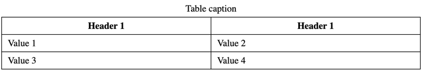
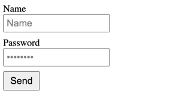

# Simple html constructor

## Usage


### Table

```python
from html.html import Style, get_html
from html.table import Caption, Table, Td, Th, Tr

style = Style(
    """
    #table {
        border-collapse: collapse;
        width: 50%;
    }
    
    #table caption {
        padding: 5px 0;
    }
    
    #table td, #table th {
        border: 1px solid black;
        padding: 5px 10px;
    }
    """
)

html = get_html(style=style)

table = Table(
    id_='table',
    children=[
        Caption('Table caption'),
        Tr(children=[Th('Header 1'), Th('Header 1')]),
        Tr(children=[Td('Value 1'), Td('Value 2')]),
        Tr(children=[Td('Value 3'), Td('Value 4')]),
    ]
)

html.body.add_child(table)
html.save('page.html')
```

### Result




### Form

```python
from html.forms import Button, Form, Input, Label
from html.html import Style, get_html
from html.tags import Br

style = Style(
    """
    label {
        font-size: 16px;
    }
    input {
        font-size: 16px;
        padding: 4px;
        margin-bottom: 8px;
        color: gray;
    }
    button {
        padding: 5px 10px;
        font-size: 16px;
    }
    """
)

html = get_html(style=style)

LabelName = Label('Name', attrs={'for': 'name'})
LabelPassword = Label('Password', attrs={'for': 'password'})

NameTag = Input(attrs={'type': 'text', 'value': 'Name', 'name': 'name'})
PasswordTag = Input(attrs={'type': 'password', 'value': 'Password', 'name': 'password'})
ButtonTag = Button(text='Send')

html.body.add_child(
    Form(children=[
        LabelName, Br(), NameTag, Br(), LabelPassword, Br(), PasswordTag, Br(), ButtonTag
    ])
)

html.save('page.html')
```


### Result

